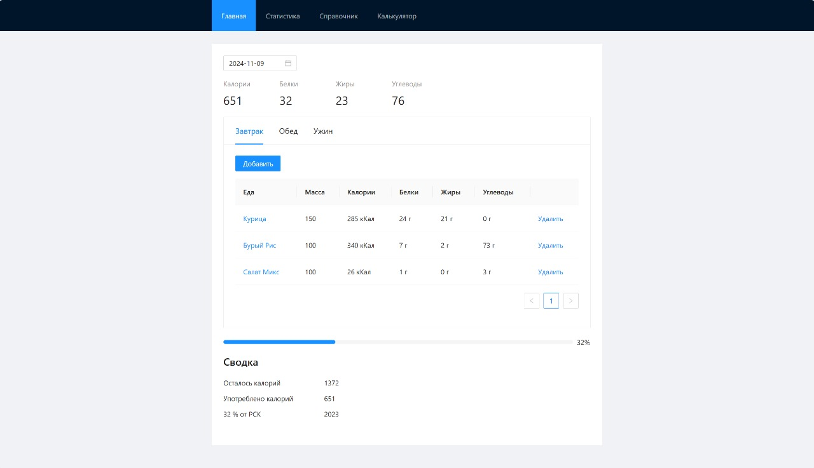
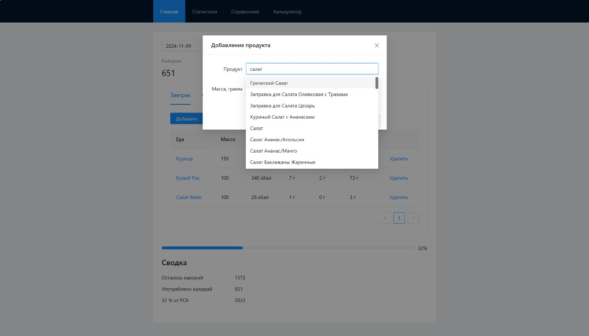
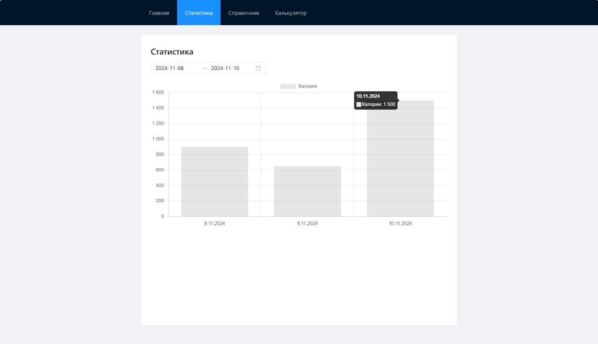
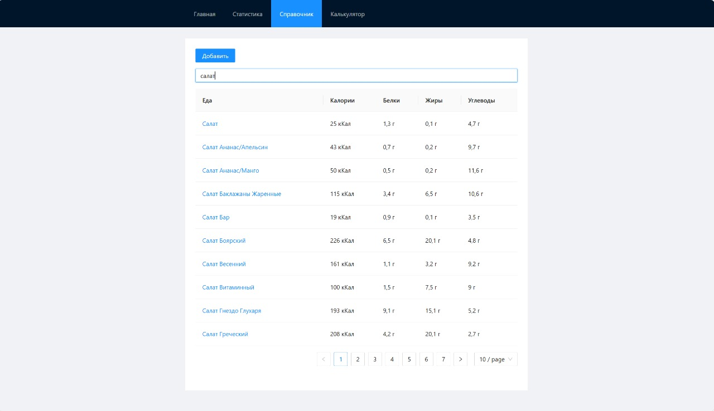
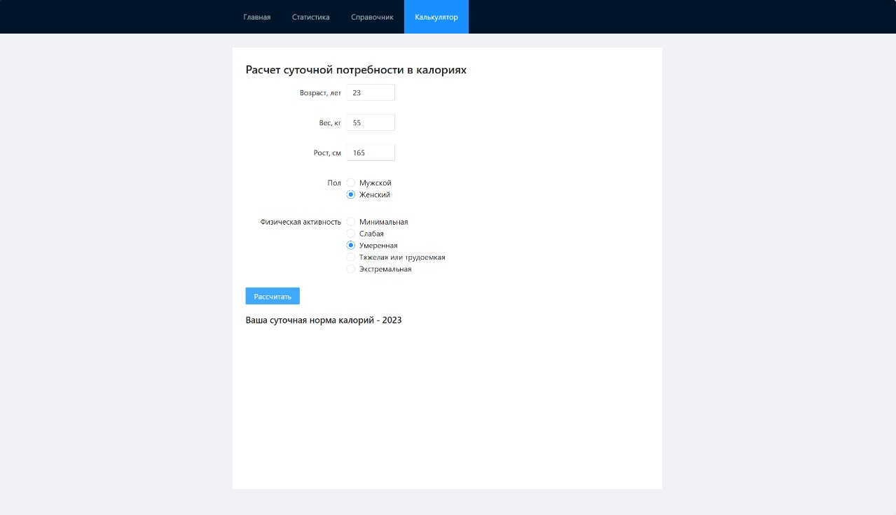

# ЗОЖ-учёт

## Описание проекта 
Приложение для учета калорий и питательных веществ. Приложение "ЗОЖ-учёт" предназначено для учета калорийности приемов пищи и позволяет следить за питательностью своего рациона

## Основные функции 
* Возможность выбора в календаре любого дня и отметки за этот день съеденных продуктов (с указанием веса продукта и расчета КБЖУ)
* Статистика и вывод графика 
* Персонализация с расчетом рекомендуемой суточной нормы калорий
* Возможность добавления собственных продуктов в базу и расчет по ним

## Используемые технологии 
* [Vue 3](https://vuejs.org/) + [Vite](https://vitejs.dev/)
* [VueRouter](https://router.vuejs.org/) - официальная библиотека маршрутизации Vue.js
* [Pinia](https://pinia.vuejs.org/) - библиотека управления состояниями для Vue.js
* [SASS](https://sass-lang.com/) - препроцессор CSS
* [Ant Design Vue](https://antdv.com/components/overview) - библиотека UI-компонентов
* [ChartJS](https://vue-chartjs.org/) - библиотека для создания графиков и диаграмм

## Сборка проекта
Прежде всего, необходимо установить зависимости. Для этого выполните следующую команду:
```
npm install
```
Затем запустите Development сервер:
```
npm run dev
```

## Описание экранов 
`Главный экран` - имеет календарь для выбора дня и просмотра/изменения рациона этого дня. При выборе дня показывается 3 раздела - завтрак, обед и ужин. Каждый из этих разделов имеет внутри себя список съеденных продуктов и кнопку "Добавить", которая открывает модальное окно для добавления продукта.

`Статистика` - содержит два инпута для выбора диапазона дат, за которые будет считаться статистика. Статистика выводится в виде столбчатой диаграммы с калориями по дням.

`Справочник` - библиотека продуктов с возможностью поиска по названию.

`Кулькулятор` - содержит в себе форму для расчета суточной нормы калорий.

## Скриншоты
<details><summary><b>Развернуть</b></summary>

[](https://elviraSolov.github.io/calories_counter)

[](https://elviraSolov.github.io/calories_counter)

[](https://elviraSolov.github.io/calories_counter)

[](https://elviraSolov.github.io/calories_counter)

[](https://elviraSolov.github.io/calories_counter)

</details>
